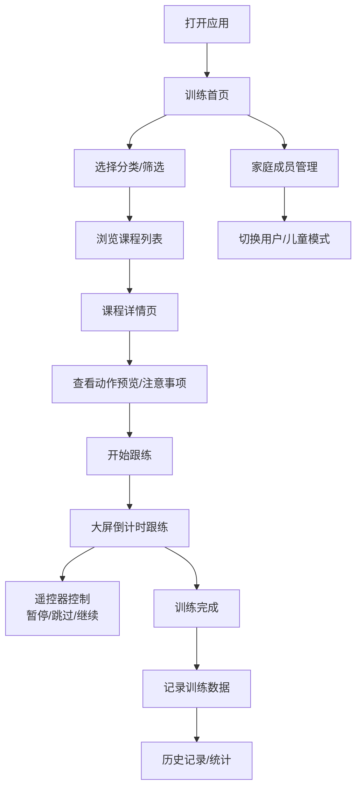

## 1. 产品概述

FitTV 是一款面向家庭用户的智能电视健身应用，提供客厅健身训练和动作跟练服务。用户可通过电视遥控器轻松选择课程、跟随大屏指导完成训练，全家人都能享受专业的健身体验。

- 核心目标：打造沉浸式大屏健身体验，让家庭用户足不出户享受专业健身指导
- 目标用户：追求健康生活方式的家庭用户，涵盖成人、儿童和老年人
- 市场价值：填补智能电视端家庭健身的空白，提供专业、便捷、全家共享的健身解决方案

## 2. 核心功能

### 2.1 用户角色

| 角色 | 注册方式 | 核心权限 |
|------|----------|----------|
| 成年用户 | 遥控器输入昵称创建 | 使用全部功能、管理家庭成员 |
| 儿童用户 | 成年用户添加创建 | 儿童模式下仅可访问低强度课程 |

### 2.2 功能模块

1. **训练首页**：课程分类导航、时长/难度筛选、推荐课程、今日推荐
2. **课程详情**：动作预览、课程介绍、注意事项、动作列表、开始训练
3. **跟练界面**：大屏倒计时、动作演示、进度条、遥控器控制（开始/暂停/跳过）
4. **家庭成员**：成员列表、添加成员、个人目标设置、收藏课程、儿童模式开关
5. **历史记录**：训练记录列表、完成率统计、消耗估算、连续天数、周报

### 2.3 页面详情

| 页面名称 | 模块名称 | 功能描述 |
|----------|----------|----------|
| 训练首页 | 顶部导航 | Logo、当前成员切换、搜索入口 |
| 训练首页 | 分类筛选 | 拉伸/燃脂/力量/肩颈放松四大分类，时长和难度筛选器 |
| 训练首页 | 今日推荐 | 根据用户习惯推荐的精选课程卡片 |
| 训练首页 | 课程列表 | 网格布局展示课程卡片，支持遥控器焦点导航 |
| 课程详情 | 课程封面 | 大图展示，包含课程标题、时长、难度、消耗 |
| 课程详情 | 动作预览 | 水平滚动展示所有动作缩略图 |
| 课程详情 | 课程介绍 | 课程描述、适合人群、注意事项 |
| 课程详情 | 动作列表 | 每个动作的名称、时长、简要说明 |
| 课程详情 | 开始按钮 | 大号焦点按钮，启动跟练模式 |
| 跟练界面 | 动作演示区 | 大屏展示当前动作示范动画/图片 |
| 跟练界面 | 倒计时 | 中央大字号倒计时数字 |
| 跟练界面 | 进度条 | 底部训练总进度和当前动作进度 |
| 跟练界面 | 控制栏 | 暂停/播放、上一个、下一个动作按钮 |
| 跟练界面 | 动作信息 | 当前动作名称、下一个动作预告 |
| 家庭成员 | 成员列表 | 头像+昵称卡片展示所有家庭成员 |
| 家庭成员 | 添加成员 | 输入昵称、选择头像、设置儿童模式 |
| 家庭成员 | 个人设置 | 健身目标、收藏课程、休息提醒设置 |
| 历史记录 | 统计概览 | 总训练时长、完成率、消耗热量、连续天数 |
| 历史记录 | 周报图表 | 本周每日训练时长柱状图 |
| 历史记录 | 训练记录 | 按日期倒序排列的训练历史列表 |

## 3. 核心流程

用户打开应用后，默认显示训练首页，可通过遥控器方向键在分类和课程间导航。选择课程后进入详情页查看动作预览和注意事项，确认后开始跟练。跟练过程中可随时暂停、跳过动作。训练完成后自动记录数据，可在历史记录中查看统计。家庭成员可切换身份，各自保存训练记录和收藏。

## 4. 用户界面设计

### 4.1 设计风格

- **主色调**：深海蓝 (#0A1628) 作为背景主色，搭配活力橙 (#FF6B35) 作为强调色
- **辅助色**：薄荷绿 (#4ECDC4) 用于成功/完成状态，柔粉 (#FFE66D) 用于儿童模式
- **设计风格**：深色沉浸式设计，适合大屏观看，减少眼睛疲劳
- **按钮风格**：圆角矩形按钮，聚焦时有明显的发光放大效果
- **字体**：大号无衬线字体，确保远距离清晰可读，标题使用粗体
- **布局**：卡片式布局，大间距，确保焦点导航清晰
- **图标风格**：线性简洁图标，聚焦时填充色彩

### 4.2 页面设计概述

| 页面名称 | 模块名称 | UI 元素 |
|----------|----------|---------|
| 训练首页 | 分类筛选 | 横向滚动标签，选中态有橙色下划线和发光效果 |
| 训练首页 | 课程卡片 | 封面图+标题+时长+难度标签，聚焦时放大并显示橙色边框 |
| 课程详情 | 动作预览 | 横向滚动动作卡片，当前选中放大显示 |
| 跟练界面 | 倒计时 | 超大字号数字居中，背景有脉冲呼吸动画 |
| 跟练界面 | 控制按钮 | 底部大图标按钮，暂停/播放居中最大 |
| 家庭成员 | 成员卡片 | 圆形头像+昵称，聚焦时头像外圈发橙光 |
| 历史记录 | 统计数字 | 大字号数据展示，配图标和趋势箭头 |

### 4.3 响应式

- 大屏优先设计，基础适配 1920x1080 和 4K 分辨率
- 遥控器焦点导航：所有可交互元素均有清晰的聚焦状态
- 使用 rem 单位确保不同尺寸屏幕下的一致性
- 触摸优化：同时支持触屏电视的触控操作

### 4.4 动画与动效

- 页面切换：淡入淡出 + 轻微缩放过渡
- 焦点移动：平滑的过渡动画，聚焦元素放大 1.05 倍并发光
- 倒计时：数字跳动动画，最后 3 秒变红并加速脉冲
- 进度条：平滑增长动画，完成时显示成功动效
- 动作切换：上滑/下滑过渡效果
