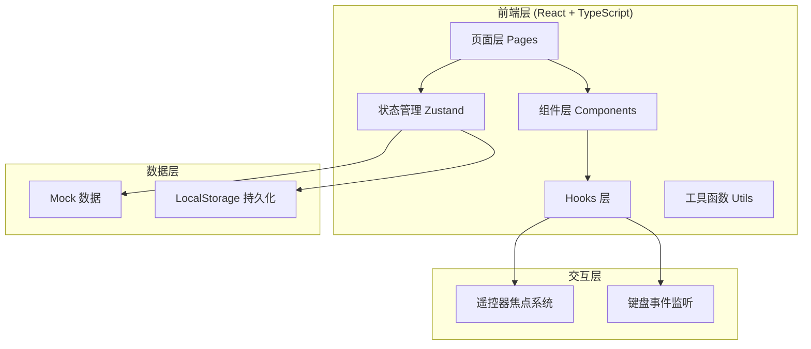
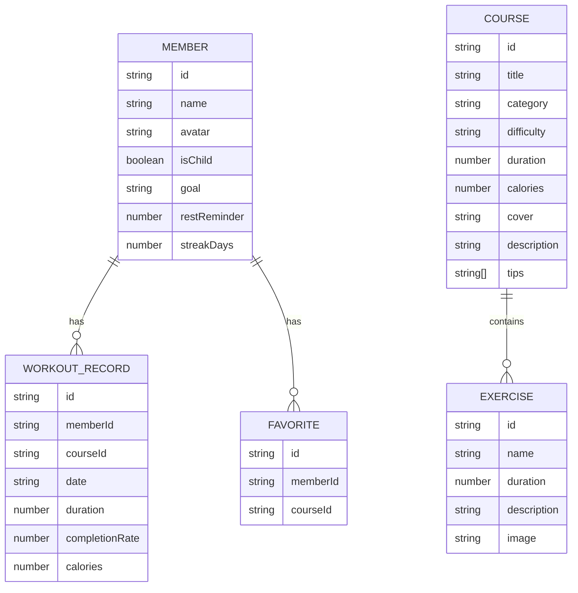

## 1. 架构设计



## 2. 技术描述

- **前端框架**：React@18 + TypeScript
- **构建工具**：Vite
- **样式方案**：TailwindCSS@3 + CSS 变量
- **状态管理**：Zustand
- **路由管理**：React Router DOM@6
- **图标库**：Lucide React
- **数据持久化**：LocalStorage
- **后端**：无（纯前端应用，使用 Mock 数据）

## 3. 路由定义

| 路由路径 | 页面名称 | 用途 |
|----------|----------|------|
| / | 训练首页 | 课程分类浏览、筛选、推荐 |
| /course/:id | 课程详情页 | 查看课程信息、动作预览、注意事项 |
| /workout/:id | 跟练界面 | 大屏倒计时跟练、遥控器控制 |
| /family | 家庭成员 | 成员管理、切换用户、个人设置 |
| /history | 历史记录 | 训练记录、统计数据、周报 |

## 4. 数据模型

### 4.1 数据模型定义



### 4.2 核心数据结构

```typescript
// 课程分类
type CourseCategory = 'stretch' | 'fatburn' | 'strength' | 'neck';

// 难度等级
type Difficulty = 'easy' | 'medium' | 'hard';

// 课程
interface Course {
  id: string;
  title: string;
  category: CourseCategory;
  difficulty: Difficulty;
  duration: number; // 分钟
  calories: number; // 消耗热量
  cover: string;
  description: string;
  tips: string[]; // 注意事项
  exercises: Exercise[];
}

// 动作
interface Exercise {
  id: string;
  name: string;
  duration: number; // 秒
  description: string;
  image: string;
}

// 家庭成员
interface FamilyMember {
  id: string;
  name: string;
  avatar: string;
  isChild: boolean;
  goal: string;
  restReminder: number; // 休息提醒间隔（分钟）
  streakDays: number;
  favorites: string[]; // 收藏课程 ID 列表
}

// 训练记录
interface WorkoutRecord {
  id: string;
  memberId: string;
  courseId: string;
  courseTitle: string;
  date: string; // ISO 日期字符串
  duration: number; // 实际训练时长（分钟）
  completionRate: number; // 完成率 0-100
  calories: number;
}

// 训练状态
interface WorkoutState {
  isPlaying: boolean;
  currentExerciseIndex: number;
  currentTime: number; // 当前动作已用时间（秒）
  totalCompleted: number; // 已完成动作数
}
```

## 5. 核心模块设计

### 5.1 遥控器焦点系统

- 自定义 `useFocus` Hook 管理焦点状态
- 支持方向键（上下左右）导航
- 支持确认键（Enter/OK）触发操作
- 支持返回键（Back/Esc）返回上一页
- 焦点元素高亮动画

### 5.2 状态管理

```typescript
// 全局 store 划分
- useCourseStore: 课程数据管理
- useMemberStore: 家庭成员管理
- useWorkoutStore: 训练状态管理
- useHistoryStore: 历史记录管理
```

### 5.3 组件层级

```
App
├── Layout (导航+内容区)
│   ├── Navbar
│   └── Pages
│       ├── Home
│       │   ├── CategoryTabs
│       │   ├── FilterBar
│       │   ├── CourseCard
│       │   └── CourseGrid
│       ├── CourseDetail
│       │   ├── CourseHeader
│       │   ├── ExercisePreview
│       │   ├── CourseInfo
│       │   └── StartButton
│       ├── Workout
│       │   ├── TimerDisplay
│       │   ├── ExerciseDisplay
│       │   ├── ProgressBar
│       │   └── ControlPanel
│       ├── Family
│       │   ├── MemberCard
│       │   ├── AddMemberModal
│       │   └── MemberSettings
│       └── History
│           ├── StatsOverview
│           ├── WeeklyChart
│           └── RecordList
```
